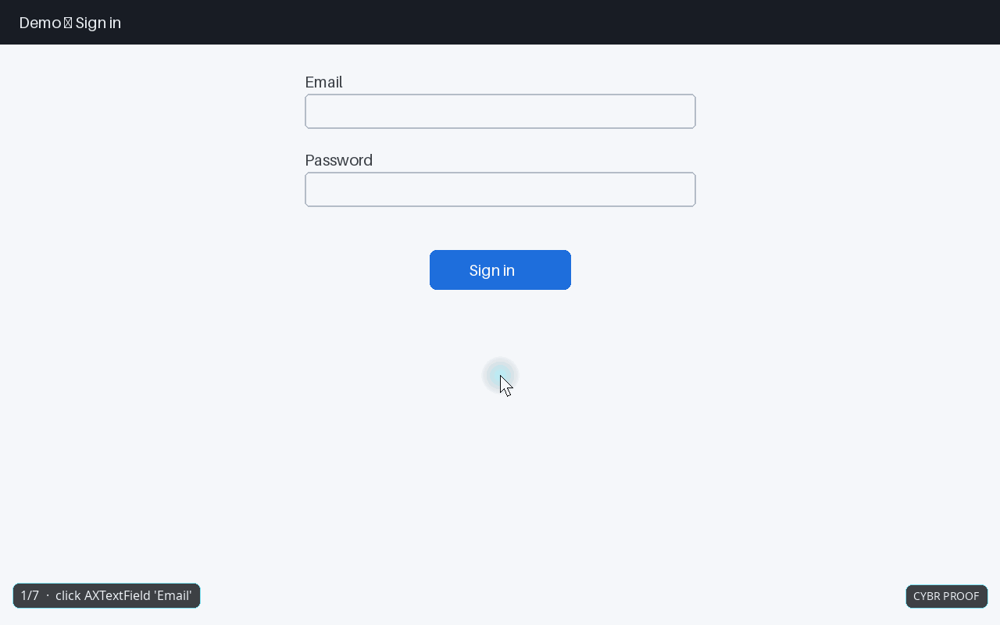

# cybr-proof

**Proof-of-work video for AI agents.** A [Hermes Agent](https://github.com/NousResearch/hermes-agent) plugin that turns every `computer_use` run into a video with an animated ghost cursor — the agent tested your product, here's the tape.

- **Zero overhead.** No screen recorder, no extra screenshots. It reuses the captures the agent already took and the click/drag/scroll coordinates it already sent, then fills the gaps with an eased, human-ish cursor path.
- **Renders when the actions end.** Hooks `on_session_end`; the mp4 is on disk a few seconds after the turn finishes.
- **PR-ready.** A `.json` sidecar + markdown step list (`cybr_proof(action="steps")`) to paste into the PR body next to the video.
- **Demo / docs footage.** Same pipeline, `--format gif|webm`, `--speed 2`.
- **Secrets stay out.** Text typed into anything that looks like a password/token field is masked before it ever hits the trace.



## Install

```bash
git clone https://github.com/CybrFlux/cybr-proof ~/cybr-proof
ln -s ~/cybr-proof ~/.hermes/plugins/cybr-proof     # $HERMES_HOME/plugins if you use profiles
hermes plugins enable cybr-proof
```

Restart Hermes (desktop app / gateway). Needs `ffmpeg` on PATH or the one Hermes already ships under `~/.hermes/tools/`; Pillow + numpy come with Hermes.

## Use

Nothing to do — drive the desktop with `computer_use` as usual. When the turn ends you get:

```
$HERMES_HOME/cybr-proof/<session_id>/
  trace.jsonl           frames + actions, append-only
  frames/0001.png …     the screenshots (Hermes' own cache only keeps ~20)
  proof-<ts>.mp4        the video
  proof-<ts>.json       steps, timings, verdicts
  latest                path of the newest render
```

Ask for it in chat: *"show me the proof video"* → the agent calls `cybr_proof(action="render")` and attaches it. Or:

| Where | Command |
|---|---|
| chat | `/proof` · `/proof render [session]` · `/proof list` |
| tool | `cybr_proof(action="render"\|"last"\|"steps"\|"status"\|"list", scope="turn"\|"session", format=…, speed=…)` |
| shell | `hermes proof list` · `hermes proof render <session> --format gif --speed 1.5` · `hermes proof steps <session>` |

## Config (`config.yaml`, all optional)

```yaml
cybr_proof:
  auto_render: true     # render at the end of every turn that used computer_use
  format: mp4           # mp4 | gif | webm
  fps: 30
  speed: 1.0            # 2.0 = twice as fast
  max_width: 1600       # downscale wider captures
  watermark: "CYBR PROOF"
  hud: true             # step counter chip
  mask_typed: false     # true = mask ALL typed text, not just secret-looking fields
```

Set with `hermes config set cybr_proof.format gif`.

## How it works

```
computer_use(capture)  ──▶ post_tool_call ──▶ frame   {png, element bounds, scale}
computer_use(click #7) ──▶ post_tool_call ──▶ action  {point = center(bounds[7]) / scale}
computer_use(type …)   ──▶ post_tool_call ──▶ action  {text (masked if secret)}
         … turn ends … ──▶ on_session_end ──▶ render thread ──▶ proof-<ts>.mp4
```

The renderer walks the trace: for every frame it holds the screenshot, animates the cursor along a bezier path to each action's target, draws a click ripple / scroll nudge / drag line / typed-text chip, then cuts to the next capture. Frames are composited with Pillow and piped raw into ffmpeg (`libx264`, `yuv420p`, faststart).

Works with any model Hermes drives — Claude, GPT, Gemini, local — because it reads tool traffic, not model output.

## Try it without a desktop

```bash
CYBR_PROOF_DIR=/tmp/cp-demo python scripts/demo.py /tmp/cp-demo/demo.mp4
```

builds a synthetic sign-in flow using the exact result shapes Hermes emits and renders it.

## Roadmap

- `browser_*` tools (screenshot + `click_at_xy`) as a second source
- ffmpeg-less fallback (animated webp via Pillow)
- auto-attach to `gh pr create` bodies

MIT · CybrFlux
